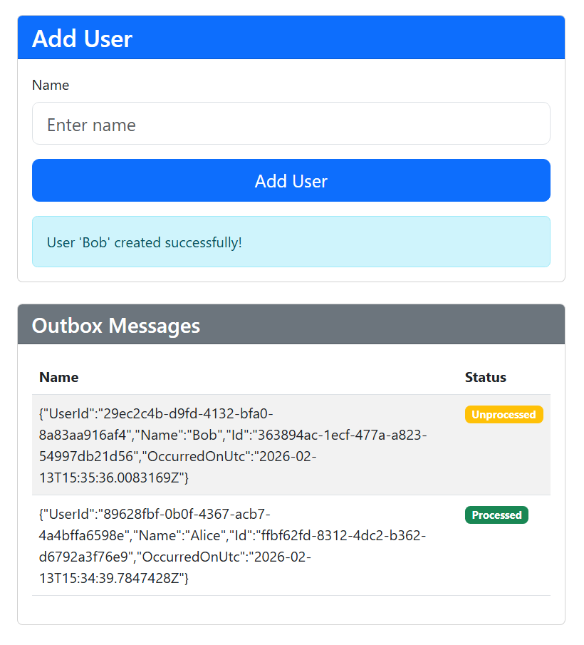

# Outbox

Transactional Outbox Experimentation

## Description

An output of some study time into some exploration of the Outbox Pattern for reliable messaging in distributed systems.

## Inspiration

- [Milan Jovanovic Blog Post - Use of the Outbox Pattern in dotnet](https://www.milanjovanovic.tech/blog/implementing-the-outbox-pattern)
- [Microsoft Learn - CosmosDB Implementation](https://learn.microsoft.com/en-us/azure/architecture/databases/guide/transactional-outbox-cosmos)
- [Microsoft Learn - EF Interceptors](https://learn.microsoft.com/en-us/ef/core/logging-events-diagnostics/interceptors)

## Local Development setup to run the example project

### Requirements
- [Docker](https://www.docker.com/get-started/)

### Usage

1. Build and run the project using Docker Compose
2. Navigate to the exposed UI endpoint, http://localhost:5002

```shell
# Common Commands

cd src                     # Navigate to the source code directory
docker compose up          # Will build and start the containers
docker compose up --build  # Will force a rebuild of the containers and start them
docker compose down        # Will stop and remove the containers and refresh the database
```



## Overall Architecture

- API to add Users to the database
- EF Interceptor adds an entry to the Outbox table in the same transaction as the User creation
- Background Service to simulate a Worker/Processor role to poll the Outbox table and complete any unprocessed entries
- Basic UI to allow input and show the in flight processing of the Outbox entries (SignalR Hub for realtime updates to the UI)
- Uses SQL Server db container for persistence (originally planned to use CosmosDB, Azurite and Change Feed Function Triggers but ran into some issues with the local emulator and arm64 support, may revisit in the future. The [vNext image](https://learn.microsoft.com/en-us/azure/cosmos-db/emulator-linux) currently has known Microsoft bugs)

> [!NOTE]
> Lots not implemented here, e.g. retry processing on errors, lease locking for multiple workers, etc.
> This is a basic starting point to demonstrate the pattern and some of the implementation details.
